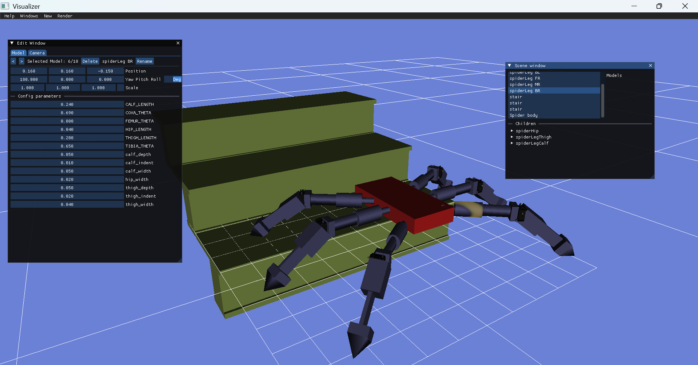

The goal of this project is to build a simulation of a hexapod robot from scratch, using OpenGL and ImGUI.
For OpenGL, i use GLAD, and GLFW.

This project was inspired by the following video: https://www.youtube.com/watch?v=VwTd5cWJx2M which achieves something similar with the library libcinder, however, I wanted to try to do all the steps without libraries.

To run this, import the project into visual studios and build.
